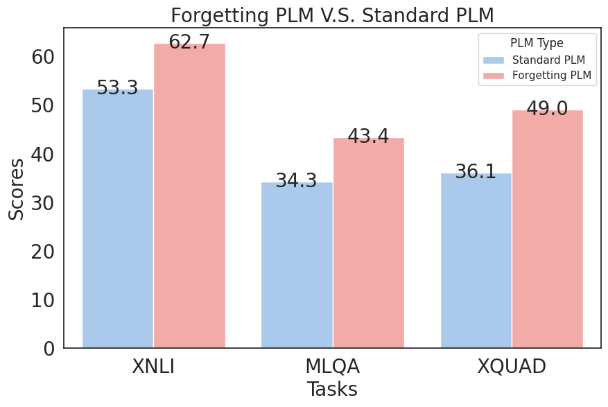
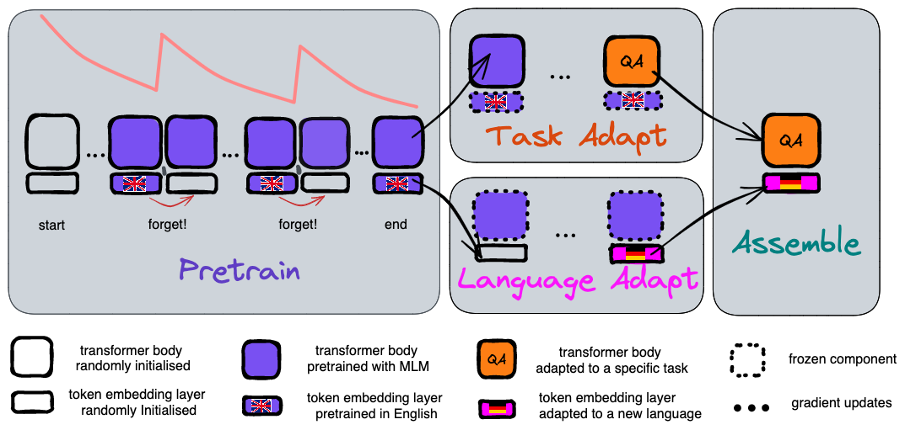

# Language Model Plasticity
This repo includes code for reproducing our paper [Improving Language Plasticity via Pretraining with Active Forgetting](https://arxiv.org/abs/2307.01163). The implementation is based on hacking [fairseq v0.12.1](https://github.com/facebookresearch/fairseq/tree/v0.12.1). The code files related to the plasticity paper are listed as follows:

- `language/`: This folder hosts the source code of fairseq v0.12.1.
- `language/plasticity`: This folder contains separate scripts for the plasticity experiments. 

Caution!!! If you have piles of data in the new language, you don't need to use forgetting pretrained models!

## Results

In a low-data regime, where new languages have only 5M tokens, forgetting pretrained English model outperform standard pretrained English model across three benchmarks XNLI, MLQA and XQUAD.

## Experiments

### Pretraining
#### Prepare data
- Download [CC100](https://data.statmt.org/cc-100/) data, choose the languages you are interested in, put them in a folder 
- Run the following commands to prepare the pretraining data. These steps include tokenizing and binarization. 
```bash
export CC100_DOWNLOAD_DIR=where_you_put_the_cc100_data`
cd language-model-plasticity/language
source plasticity/make_data_cc100.sh
```

#### Launch A Pretraining Run
On a slurm hpc cluster, launch a standard pretraining job with this command. It will generate the sbatch script, which runs `python train.py`, and submit it to slurm scheduler. Specify the slurm partition using `--partition`
```bash
export WANDB_TAGS="pretraining,standard"
python fb_sweep/sweep_roberta_base_cc100_pretrain.py --partition xxx
```
Similarly, to launch a forgetting pretraining job, run the following command
```bash
export WANDB_TAGS="pretraining,forget,adamef"
python fb_sweep/sweep_iroberta_base_cc100_pretrain.py --optimizer adamef --clip_norm 0.5 --partition xxx
```

### Language adaptation
#### Preparation: Data in the new language
Modify the script `plasticity/make_data_cc100_varied_amount.sh` to preprocess the data in the chosen new language
```bash
export CC100_DOWNLOAD_DIR=where_you_put_the_cc100_data`
cd language-model-plasticity/language
source plasticity/make_data_cc100_varied_amount.sh
```

#### Preparation: Manually reset the token embedding before language adaptation
```
cd language-model-plasticity/language
export EMB=PATH_TO_THE_PRETRAINED_MODEL
export NEW=PATH_TO_THE_RESET_MODEL
python fb_sweep/manual_reset_emb.py --emb_path $EMB --reset_path $NEW
```
We use `checkpoint_last.pt` for standard pretraining as training longer usually leads to better result. For forgetting pretraining, since the resetting operation can disrupt the specific checkpoints, we pick the `checkpoint_best.pt`.
#### Adaptation 
Adapt a forgetting pretrained model
```bash
cd language-model-plasticity/language
export EXP_DIR="./plasticity/"
export STAGE='language-adaptation'
export BIN_DIR='bin-fixed-valid-dupli-5M' # the 5M-token dataset
export BODY_CHOICE='forget'
export PRETRAINED=PATH_TO_THE_RESET_MODEL
export LANG='ar'
export WANDB_TAGS="${LANG},${STAGE},${BODY_CHOICE}"
python fb_sweep/sweep_iroberta_base_cc100_language_adapt.py --lang $LANG --restore_file $PRETRAINED --bin_dir $BIN_DIR
```
Adapt a standard pretrained model
```bash
cd language-model-plasticity/language
export EXP_DIR="./plasticity/"
export STAGE='language-adaptation'
export BIN_DIR='bin-fixed-valid-dupli-5M' # the 5M-token dataset
export BODY_CHOICE='forget'
export PRETRAINED=PATH_TO_THE_RESET_MODEL
export LANG='ar'
export WANDB_TAGS="${LANG},${STAGE},${BODY_CHOICE}"
python fb_sweep/sweep_iroberta_base_cc100_language_adapt.py --lang $LANG --restore_file $PRETRAINED --bin_dir $BIN_DIR
```


### Task adaptation
#### English NLI
```bash
cd language-model-plasticity/language
source plasticity/make_data_nli.sh

export TRAIN_DATA="plasticity/datasets/multinli_1.0/multinli_1.0_train.jsonl"
export VALID_DATA="plasticity/datasets/XNLI-1.0/xnli.dev.jsonl"
export SPM="plasticity/datasets/cc100/en/spm/cc100.en.spm.model"

## standard roberta-base
export MODEL_ALIAS='roberta-base'
export MODEL=PATH_TO_THE_PRETRAINED_MODEL
export ARCH='froberta_base'
export WANDB_TAGS="en,NLI,${MODEL_ALIAS}"
python fb_sweep/finetune_nli.py --sentencepiece-model $SPM \
                                --checkpoint $MODEL \
                                --arch $ARCH \
                                --partition learnlab \
                                --train $TRAIN_DATA \
                                --valid $VALID_DATA \
                                --valid-langs en \
                                --freeze_token_emb True \
                                --freeze_lm_head True \
                                --freeze_body False \
                                --destdir "plasticity/exps/cc100/nli-${MODEL_ALIAS}"

## forgetting iroberta-base
export MODEL_ALIAS='clip0.5.adamef.k1000'
export MODEL=PATH_TO_THE_PRETRAINED_MODEL
export ARCH='firoberta_base'
export WANDB_TAGS="en,NLI,${MODEL_ALIAS}"
python fb_sweep/finetune_nli.py --sentencepiece-model $SPM \
                                --checkpoint $MODEL \
                                --arch $ARCH \
                                --partition learnlab \
                                --train $TRAIN_DATA \
                                --valid $VALID_DATA \
                                --valid-langs en \
                                --freeze_token_emb True \
                                --freeze_lm_head True \
                                --freeze_body False \
                                --destdir "plasticity/exps/cc100/nli-${MODEL_ALIAS}"

```

#### English QA
- download SQUAD v1.0 from https://huggingface.co/datasets/squad and place it under `plasticity/datasets/squad`
- download XQUAD from https://github.com/google-deepmind/xquad and place it under `plasticity/datasets/xquad`
- download MLQA from https://github.com/facebookresearch/MLQA and place it under `plasticity/datasets/MLQA`

```bash
python fb_sweep/preprocess_xquad_mlqa.py
sh plasticity/preprocess_xquad_mlqa.sh
######### Finetune body, roberta-base
export SPM="plasticity/datasets/cc100/en/spm/spm.bpe.model"
export SQUAD_PROCESSED_FOLDER="plasticity/datasets/XQUAD_MLQA/bin"
export MLQA_EN_VALID_GOLD="plasticity/datasets/MLQA/dev/dev-context-en-question-en.json"
export DICT="plasticity/datasets/XQUAD_MLQA/en/bin/dict.txt"

echo $DICT
echo $SQUAD_PROCESSED_FOLDER
cp $DICT $SQUAD_PROCESSED_FOLDER # copy the english dictionary
echo 'Done copying dict'

export MODEL_ALIAS='roberta-base'
export MODEL=PATH_TO_THE_PRETRAINED_MODEL
export ARCH='froberta_base'
export WANDB_TAGS="en,QA,${MODEL_ALIAS}"

python fb_sweep/finetune_xquad.py --sentencepiece-model $SPM \
                        --checkpoint $MODEL \
                        --arch $ARCH \
                        --data-folder $SQUAD_PROCESSED_FOLDER \
                        --valid mlqa_valid_en \
                        --valid-gold $MLQA_EN_VALID_GOLD \
                        --partition learnlab \
                        --freeze_token_emb True \
                        --freeze_lm_head True \
                        --freeze_body False \
                        --destdir "plasticity/exps/cc100/qa-${MODEL_ALIAS}"

############ Finetune body, forgetting
export SPM="plasticity/datasets/cc100/en/spm/spm.bpe.model"
export SQUAD_PROCESSED_FOLDER="plasticity/datasets/XQUAD_MLQA/bin"
export MLQA_EN_VALID_GOLD="plasticity/datasets/MLQA/dev/dev-context-en-question-en.json"
export DICT="plasticity/datasets/XQUAD_MLQA/en/bin/dict.txt"

echo $DICT
echo $SQUAD_PROCESSED_FOLDER
cp $DICT $SQUAD_PROCESSED_FOLDER # copy the english dictionary
echo 'Done copying dict'

export MODEL_ALIAS='clip0.5.adamef.k1000'
export MODEL=PATH_TO_THE_PRETRAINED_MODEL
export ARCH='firoberta_base'
export WANDB_TAGS="en,QA,${MODEL_ALIAS}"

python fb_sweep/finetune_xquad.py --sentencepiece-model $SPM \
                        --checkpoint $MODEL \
                        --arch $ARCH \
                        --data-folder $SQUAD_PROCESSED_FOLDER \
                        --valid mlqa_valid_en \
                        --valid-gold $MLQA_EN_VALID_GOLD \
                        --partition learnlab \
                        --freeze_token_emb True \
                        --freeze_lm_head True \
                        --freeze_body False \
                        --destdir "plasticity/exps/cc100/qa-${MODEL_ALIAS}"
```


### Assemble & Evaluation
#### Assemble the embeddings (from Stage Language Adapt) and the body (from Stage Task Adapt)
```bash
# standard
export EMB=PATH_TO_YOUR_LANGUAGE_ADAPTED_MODEL
export BODY=PATH_TO_YOUR_TASK_ADAPTED_MODEL
export SPLICE="plasticity/exps/splice/nli/standard_adapt-emb-ar_finetune-body-en/"
python fb_sweep/splice_emb_body.py --emb_path $EMB --body_path $BODY --splice_path $SPLICE

# forgetting
export EMB=PATH_TO_YOUR_LANGUAGE_ADAPTED_MODEL
export BODY=PATH_TO_YOUR_TASK_ADAPTED_MODEL
export SPLICE="plasticity/exps/splice/nli/forget_adapt-emb-ar_finetune-body-en/"
python fb_sweep/splice_emb_body.py --emb_path $EMB --body_path $BODY --splice_path $SPLICE
```

#### Cross-lingual Evaluation
edit `fb_sweep/model_list/NLI_basic.py` to specify the path of the spliced model `SPLICE`. 

run the following commands for evaluation on XNLI
```bash
XNLI_DEV="plasticity/datasets/XNLI-1.0/xnli.dev.jsonl"
XNLI_TEST="plasticity/datasets/XNLI-1.0/xnli.test.jsonl"
# XNLI_DATA=$XNLI_TEST
XNLI_DATA=$XNLI_DEV

echo forget_adapt-emb-ar5000000.0-step125000_finetune-body-en
python fb_sweep/eval_xnli.py --langs ar --data $XNLI_DATA --model forget_adapt-emb-ar5000000.0-step125000_finetune-body-en --choice basic
```

run the following command for evaluation on XQUAD and MLQA
```bash
export SPLICED_MODEL="plasticity/exps/splice/nli/forget_adapt-emb-ar_finetune-body-en/"
export SQUAD_PROCESSED_FOLDER="plasticity/datasets/XQUAD_MLQA/bin"
export SPM="plasticity/datasets/cc100/en/spm/spm.bpe.model"
export L2="de"
MLQA_VALID_FOLDER=plasticity/datasets/MLQA/dev/
MLQA_L2_VALID=mlqa_valid_$L2
MLQA_L2_VALID_GOLD=$MLQA_VALID_FOLDER/dev-context-$L2-question-$L2.json
DICT="plasticity/datasets/XQUAD_MLQA/${L2}/bin/dict.txt"
cp $DICT $SQUAD_PROCESSED_FOLDER
python scripts/eval_squad.py \
    --path $SPLICED_MODEL \
    --sentencepiece-model $SPM \
    --data $SQUAD_PROCESSED_FOLDER \
    --gold_data_file $MLQA_L2_VALID_GOLD \
    --gen_subset $MLQA_L2_VALID \
    -l $L2
```

## Pretrained English Models
- pretrained with the forgetting method
- pretrained with the standard method

## Set up the environment
Hardware requirements
- The pretraining process requires 32 V100-32GB GPUs.
- The pretraining data preparation requires >= 800 GB memory; you can also split the cc100 data into chunks, shuffle within each chunk

First, load required modules if you are on a HPC cluster managed using [module](https://modules.readthedocs.io/en/latest/). Otherwise, you can install anaconda, cuda, cudnn, openmpi, and sentencepiece manually.
```bash
module load anaconda3/5.0.1
module load cudnn/v8.0.3.33-cuda.11.0
module load cuda/11.0
module load openmpi/4.1.0/cuda.11.0-gcc.9.3.0
module load sentencepiece/0.1.82/gcc.7.3.0 
```

Second, create a conda environment
```bash
conda create --name plasticity python=3.8.8
```

Third, clone this repo and install fairseq in editable mode
```bash
git clone git@github.com:facebookresearch/language-model-plasticity.git
cd ./language-model-plasticity/language
pip3 install - r requirements
pip3 install -e .
export DIR=`pwd`
export FAIRSEQ=DIR
export PATH="$CONDA_PREFIX/bin:$PATH"
```

## Main components implemented for forgetting pretraining
- adamef
- lr_emb
- iroberta


## License

This repo is CC-BY-NC licensed, as found in the LICENSE file.
